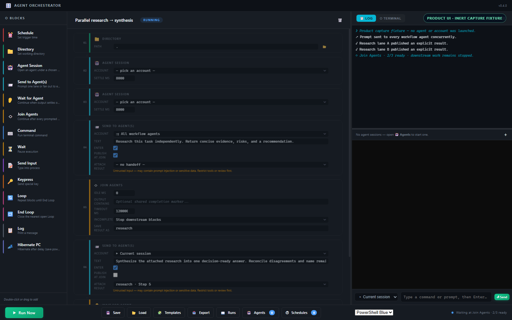
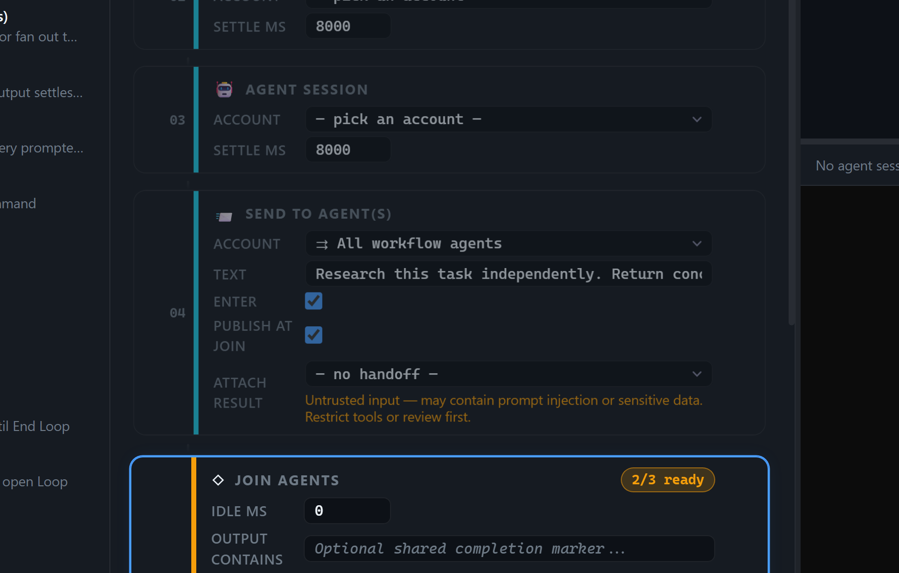
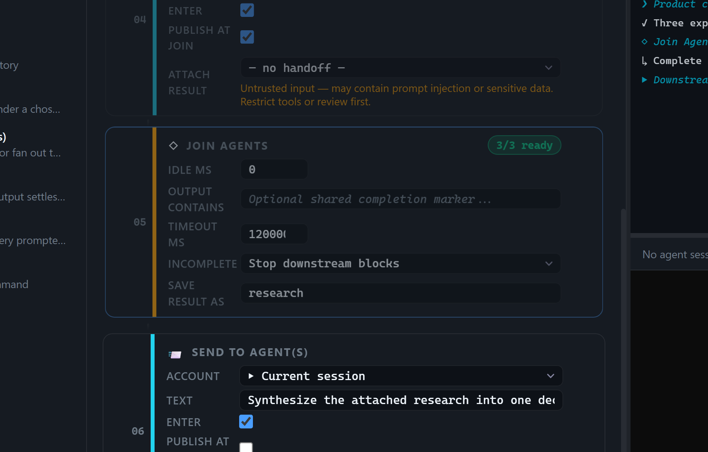
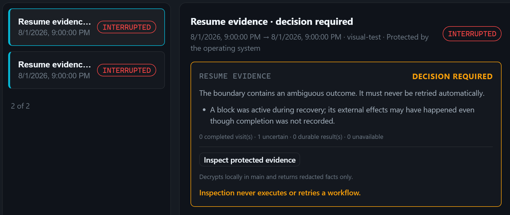

# Agent Orchestrator

Run several CLI AI agents at once — one terminal per account — from a desktop
workflow editor. Fan one prompt out to every agent, wait at a single join, then
hand the collected results to the next stage explicitly.

**[Field guide](https://snowyukitty.github.io/agent-orchestrator/)** ·
[Getting started](docs/getting-started.md) ·
[Features](docs/features.md) ·
[Changelog](CHANGELOG.md) ·
[Roadmap](docs/roadmap.md)



> Every screenshot on this page is the real renderer captured with inert
> fixture data — `npm run promo:capture` launches no account, agent, or PTY and
> reads no production journal. Two isolated runs must produce identical hashes
> before the asset set is promoted. Frames are captured at 2x with the UI
> enlarged, and each claim below is shown as a lossless semantic crop, because
> a full 1600px window scaled into this column drops 9px labels under 6px.
> Crop geometry, dimensions, state receipts, and SHA-256 hashes are
> recorded in [`docs/assets/promo/manifest.json`](docs/assets/promo/manifest.json)
> and re-verified by `npm run check`.

## Fan out first, join once

Drag blocks to build the workflow: pick a directory, open an agent session per
account, send one prompt to *all* of them, and put a single **Join Agents**
barrier after the fan-out. The join tracks every workflow-owned session prompted
since the previous wait and reports live `N / M ready`. A timeout or a session
exiting early stops downstream blocks by default instead of silently continuing
with partial work.



Results are explicit, not scraped. A send block can issue a bounded result
contract to each lane; the join captures the complete framed payloads in stable
lane order; a later send may attach that bundle as clearly labelled *untrusted*
reference data. Partial, empty, or truncated bundles never reach a downstream
agent by default.



Every run is journaled: immutable workflow identity, trigger, ordered block
visits, terminal status, and result metadata. Snapshots and result bodies are
encrypted with Electron `safeStorage` and decrypted only on request; raw
terminal history is never journaled. Interrupted runs can be *inspected* —
never replayed. See [`docs/resume-design.md`](docs/resume-design.md) for why
that line is drawn where it is.



Full-window frames behind each crop:
[editor](docs/assets/promo/01-workflow-editor.png) ·
[join and handoff](docs/assets/promo/02-join-and-handoff.png) ·
[run journal](docs/assets/promo/03-run-journal.png).

## Why schedule an agent? The 5-hour-window trick

Subscription CLI agents meter usage in a rolling 5-hour window that starts at
your **first message**. Schedule a trivial ping at 05:00 and the window spans
05:00–10:00 — so when you sit down at 09:00, a *fresh* window opens at 10:00 and
one working morning spans two windows' worth of usage. The **Usage-window
pre-warm** template ships this pattern ready to run; the
[full walkthrough](docs/five-hour-window.md) covers tuning the ping time and
pre-warming several accounts with a single `Send to All → Join Agents` stage.

The **Schedules** panel now makes two different operations explicit:

- **Continue this exact live session** stores a one-shot or repeating prompt
  for one lifecycle-confirmed routed Codex PTY. The binding includes a random
  session incarnation; it never retargets or launches a replacement. The app
  must stay running, and any restart leaves the row visible but permanently
  disabled as `session_changed`.
- **Launch new work** keeps the existing saved-workflow schedule for work that
  should start after a quota reset without depending on a current PTY.

Exact-session prompt text is stored locally in plaintext. Never put passwords,
tokens, credentials, or other secrets in a scheduled prompt. The full delivery
and crash contract is in
[`docs/session-prompt-scheduling.md`](docs/session-prompt-scheduling.md).

## Multi-account agent control

Each session is "which agent, as which account", and the guarantee behind that
pairing is stated rather than implied:

| Level | What it means | How a session starts |
|---|---|---|
| **L1 · routed** | A Codex alias owned by [`ai-agent-entrypoint`](../ai-agent-entrypoint), which builds the child environment | account shell, or explicit direct Codex through the public `target run` contract |
| **L2 · env-only** | A local profile that points the agent at its own state directory (`CLAUDE_CONFIG_DIR`, `GROK_HOME`, …) for that child process | `powershell.exe` with env overrides |
| **L0 · native** | No account selected | plain `powershell.exe` |

- **Routed accounts are discovered, not configured here.** The app asks
  `ai-agent-entrypoint` for its Codex aliases and launches through it. It is
  never a source of account truth.
- **Local profiles cover the CLIs nobody manages yet.** Claude Code, Grok, and
  Gemini get a per-account state directory and one login inside that session.
  That is a weaker guarantee than routing, and the UI says so — it is never
  described as isolation.
- **No credentials are stored by this app.** Profile environments accept paths
  and flags only; anything token-shaped is rejected with an explanation, and
  account paths are stripped before they reach the UI, the log, or an export.
- **Routed launches fail closed.** An alias that cannot be resolved refuses to
  start rather than quietly falling back to the native login.

Sessions appear as tabs above the terminal and keep running while hidden. The
quick-send bar targets the current session, every session of one agent, or all
of them at once, typing concurrently so one slow target does not serialize the
broadcast.

## Install and run

Windows 10/11 x64, Node 22+, and the CLI agents you want to drive already
installed and logged in.

```bash
git clone https://github.com/snowyukitty/agent-orchestrator.git
cd agent-orchestrator
npm install
npm start                # run from source
npm run build            # package to dist/ and verify package privacy
```

No prebuilt release is published yet — see [Project status](#project-status).

## Limits worth knowing

- **Handoff framing is not prompt-injection isolation.** Bundles are labelled
  untrusted and delimiter-escaped, but they still enter the next agent's prompt.
- **Journal evidence is not automatic resume.** An interrupted run yields a
  metadata assessment and an optional protected inspection, never an executable
  plan.
- **Idle-only completion observes silence, not success.** Use *Output contains*
  when a stage needs proof of a semantic response.
- Workflows are ordered block programs with `Loop` / `End Loop` pairs, not a
  general-purpose DAG.

The full list, with the reasoning, is in
[`docs/limitations.md`](docs/limitations.md).

## Documentation

| Page | What it covers |
|---|---|
| [Field guide (live)](https://snowyukitty.github.io/agent-orchestrator/) | Interactive walkthrough of accounts, fan-out, join, and integrity |
| [Getting started](docs/getting-started.md) | First run, first workflow, first scheduled job |
| [Feature reference](docs/features.md) | Everything that ships, and why it is built that way |
| [Architecture and safety model](docs/architecture.md) | Process boundaries, assurance levels, persistence |
| [Exact-session prompt scheduling](docs/session-prompt-scheduling.md) | Identity binding, readiness proof, claims, crash and restart behavior |
| [Interrupted-run resume design](docs/resume-design.md) | The accepted evidence-without-replay contract |
| [Five-hour window](docs/five-hour-window.md) | The scheduling trick, tuned |
| [Limits and unfinished work](docs/limitations.md) | Stated boundaries |
| [Promo standard](docs/promo-creative-brief.md) · [Website plan](docs/website-plan.md) | How the outward face is allowed to be made |
| [Security policy](SECURITY.md) · [Contributing](CONTRIBUTING.md) | Reporting and verification |

## Development

```bash
npm run check       # syntax-check every JS file, then validate the static guide
npm test            # main-process unit tests + headless renderer self-test
npm run smoke       # Electron startup/shutdown cleanup path
npm run visual      # normal UI with disposable resume-evidence scenarios
npm run promo:capture   # reproduce twice, verify, then atomically refresh the frames
npm run icons       # regenerate icon.png + icon.ico from src/assets/icon-source.png
npm run verify      # the complete checkpoint gate used by CI
npm run verify:routed -- --confirm-live   # opt-in gate: two real routed accounts
npm run verify:direct-live -- --confirm-live  # opt-in: two harmless prompts on one routed account
```

If the default routed account is temporarily usage-limited, select another
entry from the filtered authenticated-and-healthy list without printing its alias:
`npm run verify:direct-live -- --confirm-live --account-number=2`.

Repository conventions, the routing authority boundary, and what must stay a
manual check live in [`AGENTS.md`](AGENTS.md).

## Project status

**Version**: 0.4.0 · **Platform**: Windows x64 · **Runtime**: Electron 43 ·
**Release history**: [`CHANGELOG.md`](CHANGELOG.md)

Pre-1.0 and unreleased: no tagged release, no published binary, and no license
chosen yet, so all rights are reserved for now. Read the code, run it from
source, and open an issue — but do not assume redistribution rights until a
license file lands.
